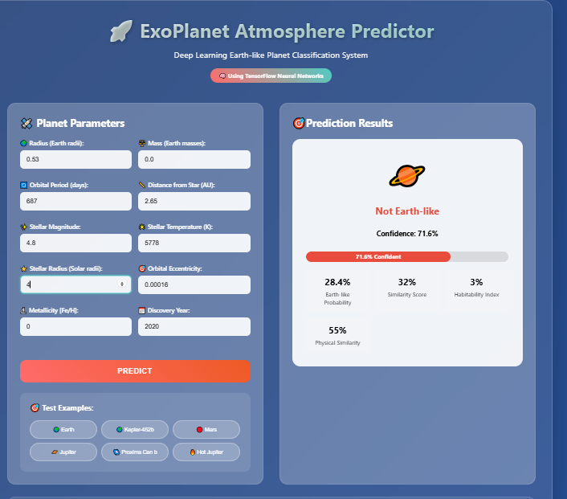

# ExoPlanet ASTRA 🌌

ExoPlanet ASTRA is a machine learning project designed to predict Earth-like exoplanets and analyze their characteristics.  
It includes data visualizations, performance analysis, and a simple web interface for exploring predictions.

---

## 🚀 Features
- Predict likelihood of exoplanets being Earth-like  
- Visualize stellar and orbital properties  
- Explore feature correlations and model performance  
- Interactive web page (`exo_planet_predictor.html`)  
- Clear plots for similarity, radius, mass, and temperature comparisons  

---

## 📦 Prerequisites
Make sure you have the following installed:
- **Python 3.x**  
- **Required libraries** (see `requirements.txt` if available):  
  - pandas  
  - numpy  
  - matplotlib / seaborn  
  - scikit-learn  
  - (optional) Streamlit / Flask if you plan to make the web interface interactive  

---

## 🔧 Installation

1. Clone the repository:
   ```bash
   git clone https://github.com/mrudula-kilani/ExoPlanet_ASTRA.git
   cd ExoPlanet_ASTRA
2. Install dependencies:
   ```bash
   pip install -r requirements.txt
   ▶️ Usage

3. Run the main prediction script:
    ```bash
   python earth_like_planet_prediction.py
4. View results:
   Check generated plots in the images/ folder
   Open exo_planet_predictor.html in a browser to view the web interface
   
## 📁 Project Structure
    ```plain text
    ExoPlanet_ASTRA/
    │
    ├── earth_like_planet_prediction.py    # Main ML script
    ├── exo_planet_predictor.html          # Web interface
    ├── README.md                          # Project documentation
    ├── requirements.txt                   # Dependencies (to be created)
    │
    └── images/                            # All generated plots
      ├── earth_similarity_distribution.png
      ├── feature_correlation_matrix.png
      ├── mass_vs_similarity.png
      ├── model_performance_analysis.png
      ├── orbital_characteristics.png
      ├── plotting_history_plots.png
      ├── radius_vs_similarity.png
      ├── stellar_properties.png
      ├── stellar_temperature_vs_similarity.png
      ├── web_page_image.png
      └── web_page_image2.png


    
🌍 Example Output

### 🌐 Web Page Demo
  
  
web_page_image.png
